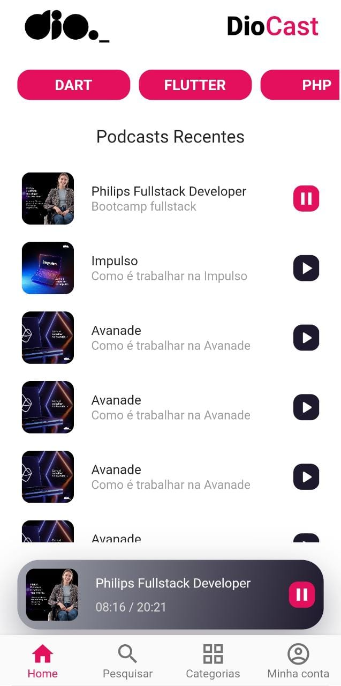
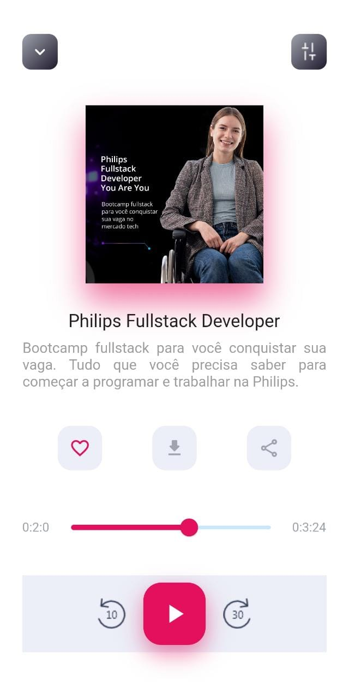
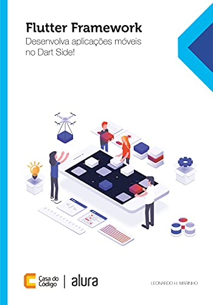
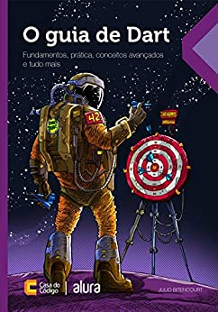

## LIVE CODING - FLUTTER CRIAÇÃO DA UI PODCAST DIO

Muito se tem falado de PodCast e do potencial que essa ferramenta tem em levar informação aos diversos usuários. Os podcasts permitem que o público ouça passivamente o conteúdo enquanto realiza outras atividades. Bem, isso significa que o público pode aprender sobre seus serviços e produtos sem precisar interromper o que está fazendo ou enquanto realiza tarefas diárias. Nesse sentido, iremos criar uma UI em flutter do PodCast Dio que hoje é apresentado no youtube, mas que poderá tornar-se um app futuramente. O objetivo é compreender sobre layout, recursos do flutter para criação de widgets, cards, Bottom navigation, modelo de um player de áudio. Essas são algumas das questões que serão abordadas pelo Expert Instructor João Paulo Miranda Matias nesta Live Coding.

 <figure>
 
 <figcaption>Fig.1 - HomePage do Podcast Dio</figcaption>
 </figure>
 <figure>
 
 <figcaption>Fig.2 - PodCastPage </figcaption>
 </figure>
 

#### INDICAÇÃO DE LEITURA

##### Flutter

 

 

##### Dart

 

OBS: Link afiliado ao Amazon.

#### ARTIGOS RELACIONADOS
[Roadmap Flutter](http://joaopaulomirandamatias.com/portifolio/index.php?class=ArticleView&method=onView&id=1)

#### :mailbox: How to reach me:  

#### 📺: My channel:

[Digital Inovation One!](https://web.dio.me/)
